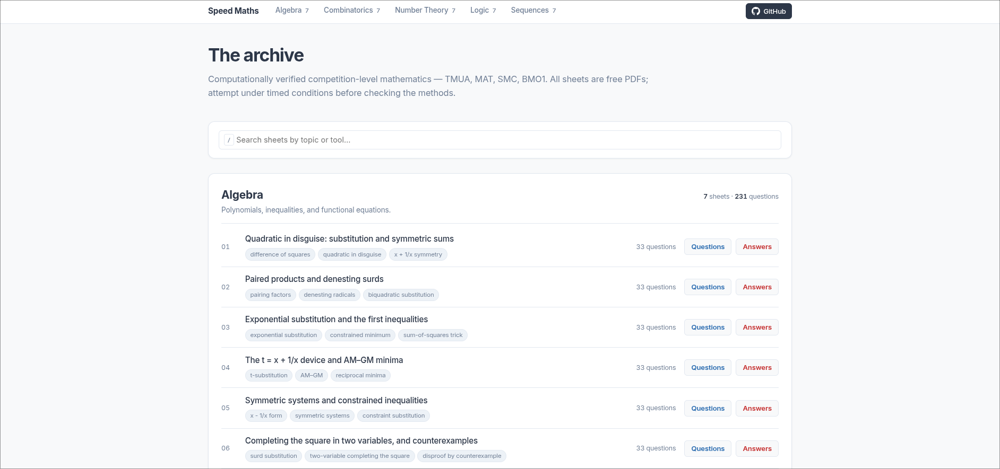

<h1 align='center'>Speed Maths</h1>
<div align='center'>
<div style="display: flex; gap: 10px; align-items: center; flex-wrap: wrap;">
    <a href="https://speedmaths.co.uk">
    
  </a>
  <a href="verify/BINDING_BASELINE.json">
    
  </a>
  <a href="tests/">
    
  </a>
  <a href="sheets/">
    
  </a>
    <p>Computationally verified corpus for TMUA and competition (SMC, BMO1) preparation.</p>
    
</div>
</div>


[](https://speedmaths.co.uk)

## For Students (TMUA & Competition Prep)

If you are revising for university admissions tests, you know the three biggest problems: official past papers run out fast, some external papers are sketchy, and answer keys are wrong.

This repository contains 1,155 original questions across 5 pillars — Algebra, Combinatorics, Logic, Number Theory and Sequences — at 33 questions on each of 7 daily sheets per pillar. Every answer has a committed, re-runnable Python script behind it, and a machine gate checks that the script actually compares its own result against the answer printed in the PDF.

**How to use this:**
1. Navigate to the `sheets/` or the website [speedmaths.co.uk](https://speedmaths.co.uk) for any pillar.
2. Do one daily drill (Sections A--C for TMUA speed and accuracy; Section D for deep competition extension).
3. Check your work against the `answers/` directory. If you disagree with the answer key, check the pillar's `verify/sheetNN_verify.py` for that question — it shows exactly what was computed and how. If it turns out to be wrong, that is a bug worth reporting; see the Bounty below.
4. **Tackle the "Investigate further" callouts:** Answer sheets contain interview-style follow-up questions, generalisations, and prompts (`\inv{...}`) designed for maths interviews and STEP preparation.

---

## Architecture (For Engineers & Contributors)

Two halves, because they catch different things.

**Runtime**, in `tests/`: one parametrised test over all 1,155 questions. It imports each pillar's verify script, runs the check for a question, and compares the value it returns against the `\ans{}` in the `.tex`.

1. **AST parsing** (`tools/latex_bridge.py`): strips `.tex` formatting, handles juxtaposition edge cases, and compiles expressions like `\ans{\frac{x(x+1)}{2}}` into SymPy nodes.
2. **Comparison** (`tools/answer_binding.py`): one reviewed comparison for the whole corpus rather than 1,155 authors each improvising one. Handles expressions, value lists, booleans and multiple-choice letters, and reports honestly which of those it managed — `EXACT`, `DRIFT_ONLY` or `EXEMPT`.
3. **Property-based testing** (`hypothesis`): fuzz-tests combinatorial recurrences and algebraic identities across randomised integer boundaries.
4. **Negative controls** (`tests/test_binding_rejects_wrong_answers.py`): every answer is perturbed and the comparison required to reject it. Without this, a comparison that returned `True` unconditionally would pass all 1,155 cases and the whole gate would be decorative slop.

**Static**, in `tools/check_binding.py`: a passing suite cannot detect a check that passes while verifying nothing, because the check passes. So that is checked in the source instead — every published question must have a non-empty body, at least one assertion that depends on a value it computed, and a link to its answer key.

**Mutation testing** (`mutmut`) targets `tools/`, where the library code lives and `tests/` is its consumer. It is a manual and nightly job, not a CI gate — a full run is far slower than a pull request should wait for. It is *not* pointed at the check scripts: a check function cannot be both the mutant and its own test, and when it was configured that way every one of the 9,016 generated mutants came back "no tests" and nothing was ever killed.

---

## Paired Verification Structure

Every answer sheet item pairs its LaTeX source with an independently computed Python verification check:

```latex
% ── LaTeX Answer Key (algebra/answers/ans01.tex) ─────────────────────────────
\item Factorise completely: $\;x^4 - 16$.

\ans{$(x^2+4)(x+2)(x-2)$}
\method{Apply the difference of two squares twice: $(x^2)^2 - 4^2 = (x^2+4)(x^2-4) = (x^2+4)(x+2)(x-2)$.}
\inv{Can you factorise $x^4+16$ over the real numbers? Hint: Add and subtract $8x^2$ to complete the square, creating a hidden difference of squares.}
```

```python
# ── Paired Python Verification Check (algebra/verify/sheet01_verify.py) ──────
def check_A1():
    """ SAMPLED CHECK: Random integer testing of factorization """
    for x in range(-50, 50):
        assert x ** 4 - 16 == (x ** 2 + 4) * (x + 2) * (x - 2)
    return get_answer(TEX_PATH, 'A1')
```

---

## Layout

```text
Speed-Maths/
├── shared/
│   └── preamble.tex           (LaTeX styles and macros)
├── algebra/                   (live: 7 sheets, 231 questions)
│   ├── sheets/ & answers/
│   └── verify/                (one script per sheet, 33 checks each)
├── combinatorics/             (live)
├── logic/                     (live)
├── number-theory/             (live)
├── sequences/                 (live)
├── tests/
│   ├── test_answer_binding.py             (all 1,155 answers vs their checks)
│   └── test_binding_rejects_wrong_answers.py   (negative controls)
├── tools/
│   ├── latex_bridge.py        (LaTeX -> SymPy)
│   ├── answer_binding.py      (the comparison, and its honest strength)
│   ├── check_binding.py       (static gate + ratchet)
│   ├── analyze_facades.py     (checks that verify nothing)
│   ├── validate_verify_scripts.py
│   └── build_website.py
├── verify/
│   ├── BINDING_BASELINE.json  (ratchet gate; permanently empty at 0 violations, for now...)
│   └── BINDING_EXEMPTIONS.md  (the 78 "Proof: see method" answers)
├── template.html
└── index.html                 (auto-generated artifact)
```

## Conventions

A new sheet cannot be merged without a verify script that passes and binds. See `CONTRIBUTING.md` for the pipeline.

- **Numbering:** two-digit, zero-padded (`sheet01`).
- **LaTeX:** include `\input{../../shared/preamble}`.
- **Answers:** wrap in `\ans{...}` for `latex_bridge` parsing.
- **Checks:** `return` the value you verified, so the harness compares it to the `.tex`.
- **Compilation:** run `pdflatex` from within `sheets/` or `answers/`.

---

## The Bounty (Hall of Fame)

If you find a mathematical error in a compiled answer key, open a GitHub Issue(or contact me) — that is the most valuable contribution to this repo (apart from sheet contributions ofc).

**A wrong answer is claimable.** Every published answer in the corpus has an active verification check. If you can show a mathematically incorrect answer surviving in the PDF or in a check, that is a defect in the verification pipeline or answer key. Your name goes in the Hall of Fame below; open an issue with your derivation and counterexample.

*No bounties claimed yet.* 

---

## Roadmap

The static PDF corpus is open source, and it is the whole of what this repo publishes.

### Prospective pillars (Needs Authors)
1. **Speed Calculus** (Integration and Differentiation, majorly TMUA)
2. **Speed Graphs** (Sketches and limits, TMUA and SMC territory)
3. **Speed Logs** (Exponentials and Logarithms, majorly TMUA)
4. **Speed Geometry** (Classical Geometry, mainly BMO1, SMC and TMUA)
5. **Speed Trig** (Trigonometry, TMUA, SMC)

Next, in order:
1. Release Calculus and Graphs pillars once their 7-day drill arcs and verification suites complete review.
2. Reduce the 78 exemptions in `verify/BINDING_EXEMPTIONS.md` by rewriting "Proof: see method" answers as the explicit identity or closed-form bound they establish.
